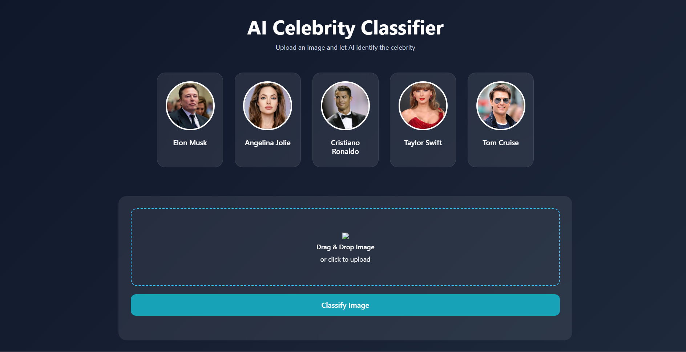
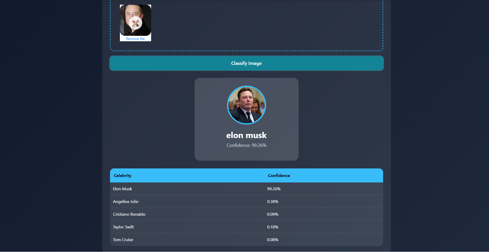

# AI Celebrity Classifier

Celebrity Classifier is a simple machine-learning web app that predicts which celebrity is shown in an uploaded image.

The user uploads an image through the web page. The Flask server processes the image, detects the face, extracts features, and returns the predicted celebrity name with confidence scores.

## Features

* Upload celebrity images
* AI-powered face classification
* Confidence score prediction
* Modern responsive UI
* Flask backend integration
* Drag and drop image upload
* Real-time prediction results

## Screenshots

### Home Page



### Prediction Result



---

## Celebrities the model can classify

The current model can recognize these celebrities:

* Angelina Jolie
* Cristiano Ronaldo
* Elon Musk
* Taylor Swift
* Tom Cruise

---

## How the project works

```text
User uploads an image
        ↓
Image is sent to the Flask server
        ↓
Face is detected from the image
        ↓
Image features are extracted
        ↓
Trained model predicts the celebrity
        ↓
Result is shown on the web page
```

---

## Technologies used

* Python
* Flask
* OpenCV
* MediaPipe
* PyWavelets
* scikit-learn
* HTML
* CSS
* JavaScript
* Dropzone.js

---

## Project structure

```text
AI-Celebrity-Classifier/
│
├── model/
│   ├── dataset/
│   ├── face detector/
│   ├── test_images/
│   ├── celebrity classifier.ipynb
│   ├── face_landmarker.task
│   └── requirements.txt
├── server/
│   ├── artifacts/
│   │   ├── class_dictionary.json
│   │   └── saved_model.pkl
│   │
│   ├── server.py
│   ├── util.py
│   ├── wavelet.py
│   └── face_landmarker.task
│
├── UI/
│   ├── images/
│   ├── test_images/
│   ├── app.html
│   ├── app.css
│   ├── app.js
│   ├── dropzone.min.css
│   └── dropzone.min.js
│
├── README.md
└── ui_snapshots/
    ├── home.jpg
    └── result.jpg
```

---

## Main folders explained

### `model/`

This folder contains the dataset, training notebook, face detection files, and model-building code.

The notebook `celebrity classifier.ipynb` is used to train the machine-learning model.

### `server/`

This folder contains the Flask backend.

Important files:

* `server.py` starts the Flask server.
* `util.py` loads the trained model and makes predictions.
* `wavelet.py` is used for wavelet image feature extraction.
* `artifacts/saved_model.pkl` is the trained model.
* `artifacts/class_dictionary.json` maps celebrity names to class numbers.

### `UI/`

This folder contains the frontend files.

Important files:

* `app.html` is the main web page.
* `app.css` styles the web page.
* `app.js` sends the uploaded image to the backend and displays the result.
* `images/` stores celebrity images used in the UI.

---

## Installation

First, install the required Python packages:

```bash
pip install -r requirements.txt
```

If that does not work, install the packages manually:

```bash
pip install flask numpy opencv-python mediapipe pywavelets scikit-learn joblib pandas
```

---

## How to run the project

### 1. Start the Flask server

Go to the `server/` folder:

```bash
cd server
```

Run the server:

```bash
python server.py
```

The backend will run at:

```text
http://127.0.0.1:5000
```

---

### 2. Open the web page

Open this file in the browser:

```text
UI/app.html
```

Upload a celebrity image and click the classify button.

The predicted celebrity name and confidence scores will be shown on the page.

---

## API endpoint

The frontend sends the uploaded image to this backend endpoint:

```text
POST /classify_image
```

The image is sent as Base64 data using the field name:

```text
image_data
```

Example response:

```json
[
  {
    "class": "cristiano_ronaldo",
    "class_probability": [2.14, 91.62, 1.03, 3.77, 1.44]
  }
]
```

## Credits

This project was inspired by and built while learning from the excellent machine learning tutorials by Codebasics.

Special thanks to:

### Machine Learning Project Playlist

https://www.youtube.com/playlist?list=PLeo1K3hjS3uvaRHZLl-jLovIjBP14QTXc

The tutorials provided valuable guidance on:
* image classification
* computer vision workflows
* Flask integration
* machine learning deployment
* end-to-end AI project development

---